##  {.title background-image="images/title.jpg"}

::: {.r-fit-text style="text-align: center;"}
<br>
[The]{style="color: black; text-shadow: -1px -1px 0 #fff, 1px -1px 0 #fff, -1px 1px 0 #fff, 1px 1px 0 #fff;"} [Invisible]{.flow} [Work]{style="color: black; text-shadow: -1px -1px 0 #fff, 1px -1px 0 #fff, -1px 1px 0 #fff, 1px 1px 0 #fff;"}

[of]{style="color: black; text-shadow: -1px -1px 0 #fff, 1px -1px 0 #fff, -1px 1px 0 #fff, 1px 1px 0 #fff;"}

[Data  Science  Projects]{style="color: black; text-shadow: -1px -1px 0 #fff, 1px -1px 0 #fff, -1px 1px 0 #fff, 1px 1px 0 #fff;"}
<br>
:::

::: notes
Today, I want to talk about invisible work in data projects.
:::

## {background-image="images/first-kind.jpg"}

::: notes
Most of us already know one kind of it: the hidden technical work that makes everything possible but rarely makes it into the final product. Cleaning messy data. Debugging a pipeline that broke. This work is everywhere, and it's largely unseen. But there's another kind of invisible work that's easy to miss. Not the work you do, but the work that was done before you arrived. What does it mean to work with a dataset you didn't collect? What does it mean to use Python, R, or the last package you downloaded? What does it mean to trust outputs from AI? In reality, data work is built on layers of decisions that others have already made. And every time we use a dataset, a package, or a model, we inherit those decisions, and we have to decide what to do about them.
:::

##

[Those who receive the results of modern data analysis]{.fragment} [have limited opportunity to verify the results by direct observation.]{.fragment} [Users of the analysis have no option but to trust the analysis,]{.fragment} [and by extension]{.fragment} [the software that produced it.]{.fragment} [Both the data analyst and the software provider therefore have a strong responsibility]{.fragment} [to produce a result that is trustworthy,]{.fragment} [and, if possible,]{.fragment} [one that can be shown to be trustworthy.
<br>
<br>
— John M. Chambers]{.fragment}

::: notes
John M. Chambers — the statistician who designed the S language, the direct precursor to R — once wrote [read quote]. What Chambers is describing is structural is about the nature of data work itself. The people who receive our results have limited ability to verify them independently. They have to trust us. And that means we carry a real obligation — not just to be technically correct, but to be trustworthy in a way that can, ideally, be shown.
:::

## {background-image="images/trust.jpg"}

::: footer
Photo by <a href="https://unsplash.com/@headwayio?utm_source=unsplash&utm_medium=referral&utm_content=creditCopyText">Headway</a> on <a href="https://unsplash.com/photos/black-smartphone-near-person-5QgIuuBxKwM?utm_source=unsplash&utm_medium=referral&utm_content=creditCopyText">Unsplash</a>
:::

::: notes
Most of the people who act on your work will never see your code or your validation report. They will read a table, a chart, a dashboard. And they will trust your work. Which means they are trusting you, trusting us, and everything we built on top of.  The invisible work is all of the decisions and effort that go into building trust. And I mean building trust in two directions.
:::

##

<center>

{width=20%}

[ \@ivelasq3](https://bsky.app/profile/ivelasq3.bsky.social)

[ \@ivelasq](https://github.com/ivelasq)

[ \@ivelasq](https://linkedin.com/in/ivelasq/)

[ ivelasq.rbind.io](https://ivelasq.rbind.io)

</center>

## {background-color="#2E1836"}

::: {.absolute top="10%" left="0" right="0" style="text-align: center; font-size: 2.5em;"}
Data practitioners need to be [trustworthy]{.fragment}[, and trusting.]{.fragment}[*]{.fragment}
:::

::: notes
We need to be trustworthy—to produce work that is sound, transparent, and accurate. (click) But we also need to be trusting—because we rely constantly on data, tools, and systems that we cannot fully verify. (click) With an asterisk. Let’s return to that. If so much of the work is invisible—both what we do and what we inherit—how do we make trust something we can actually show? And to begin, I’d like to start with something that is also invisible:
:::

## {background-image="images/microplastics.jpeg"}

::: notes
microplastics. Did anyone see this story? Scientists studying microplastics in the environment discovered that their plastic gloves may have been contaminating their samples, leading to a significant overestimate of microplastics in the data they'd collected. Think about what had to be true for them to catch this. They had to know what plastic gloves were present during collection. They had to understand how the measurement process worked well enough to ask: could something in our procedure be introducing error? They had domain knowledge, and they had proximity to data collection. Those two things together made it possible to say: wait, something might be wrong here. I don't know much about microplastics, but I imagine that these scientists were able to question their data because they understood how it was produced.
:::

## {background-image="images/measuring.jpg"}


::: footer
Photo by <a href="https://unsplash.com/@cdc?utm_source=unsplash&utm_medium=referral&utm_content=creditCopyText">CDC</a> on <a href="https://unsplash.com/photos/person-holding-tube-XLhDvfz0sUM?utm_source=unsplash&utm_medium=referral&utm_content=creditCopyText">Unsplash</a>
:::

::: notes
Your careers may well take you places where you collect your own data. But data practitioners often do not have proximity to data collection. We are given data. Sometimes it's been cleaned by someone else. Often it's underdocumented or not documented at all. Sometimes, we don’t even have domain expertise. You may have jobs where you move across industries and never stay long enough to develop deep domain knowledge in any one area. If you weren't there when the data was collected — if you don't know what plastic gloves were in the room, so to speak — how are you supposed to know when something is off? This is one of the first and most fundamental challenges of working with inherited data. So what do you do?
:::

##

::: {.r-fit-text}

[Procedural]{.fragment data-fragment-index="1"} trust

:::

::::: {.fragment}

:::: columns

::: {.column style="text-align: center;"}
Data provenance

Data lineage

Data contracts

Observability

Data dictionaries

Monitoring
:::

::: {.column style="text-align: center;"}
Versioning

Unit tests

Code review

Disaggregation

Metadata

Confidence intervals
:::

::::

:::::

::: notes
Here, we return to the asterisk from earlier. You can't manufacture proximity you don't have. But you can develop what I'd call procedural trust: not blind faith in your data, but a disciplined habit of asking questions before you analyze anything. Tests, checks, documented assumptions. A way of working that makes your reasoning visible, so others can evaluate it, and so you can catch problems before they travel downstream.  There are many ways of building this sort of procedural trust, one of which is called data provenance.
:::

## {background-image="images/dataset.jpeg"}

::: {style="text-align: center;" }
[Data Provenance]{style="color: #4C4E52; background-color: white; font-size: 60px;"}
<br>
[Source]{style="color: #4C4E52; background-color: white;"}
<br>
[Transformations]{style="color: #4C4E52; background-color: white;"}
<br>
[Timeframe]{style="color: #4C4E52; background-color: white;"}
<br>
[Schema]{style="color: #4C4E52; background-color: white;"}
<br>
[Software version]{style="color: #4C4E52; background-color: white;"}
<br>
[Funding]{style="color: #4C4E52; background-color: white;"}
<br>
[Intent]{style="color: #4C4E52; background-color: white;"}
<br>
[Erasure]{style="color: #4C4E52; background-color: white;"}
<br>
[Handoffs]{style="color: #4C4E52; background-color: white;"}
:::

::: notes
Before any analysis, before any modeling, sit with a new dataset and ask simple question: what am I actually working with? I mean something more specific than 'what are the column names.' I mean to really sit with it. Where did this data come from, and who collected it? When, and for what purpose? What system produced it — was it app logs, survey responses, billing records, sensors? What decisions were made before it landed in your hands — about what to record, what to exclude, how to define things? Some of the most consequential assumptions in data work are invisible ones. These assumptions are rarely documented. You have to surface them yourself.
:::

## {background-image="images/nasa.jpeg"}

::: notes
As an example of a data provenance mistake. On September 23, 1999, NASA lost the $125 million Mars Climate Orbiter spacecraft after a 286-day journey to Mars. Lockheed Martin, which was performing the calculations, was sending thruster data in English units (pounds). Miscalculations due to the use of English units instead of metric units apparently sent the craft slowly off course - 60 miles in all. Thrusters used to help point the spacecraft had, over the course of months, been fired incorrectly because data used to control the wheels were calculated in incorrect units. The Orbiter didn't crash because of a math error; it crashed because the metadata (the "story" of where the numbers came from and what they represented) was lost.
:::

##

:::: columns

::: column

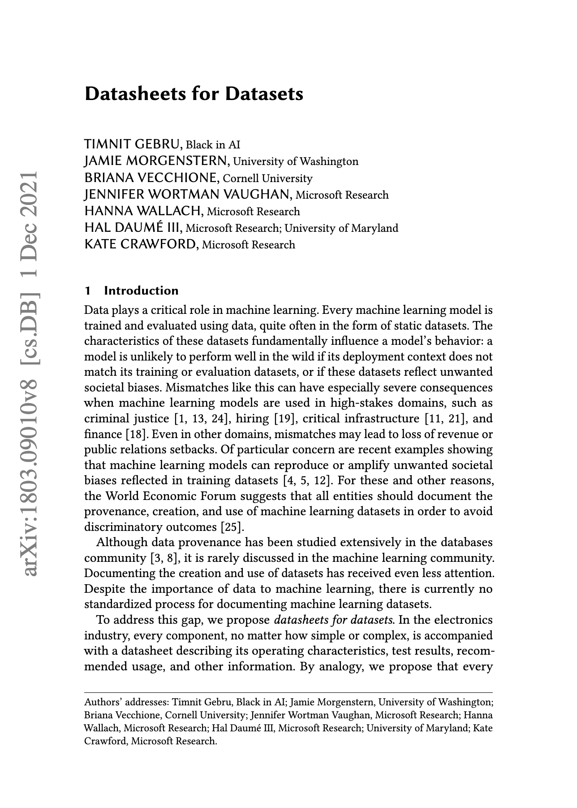{style="box-shadow: 5px 5px 15px rgba(0,0,0,0.5);" width=80%}

:::

::: column

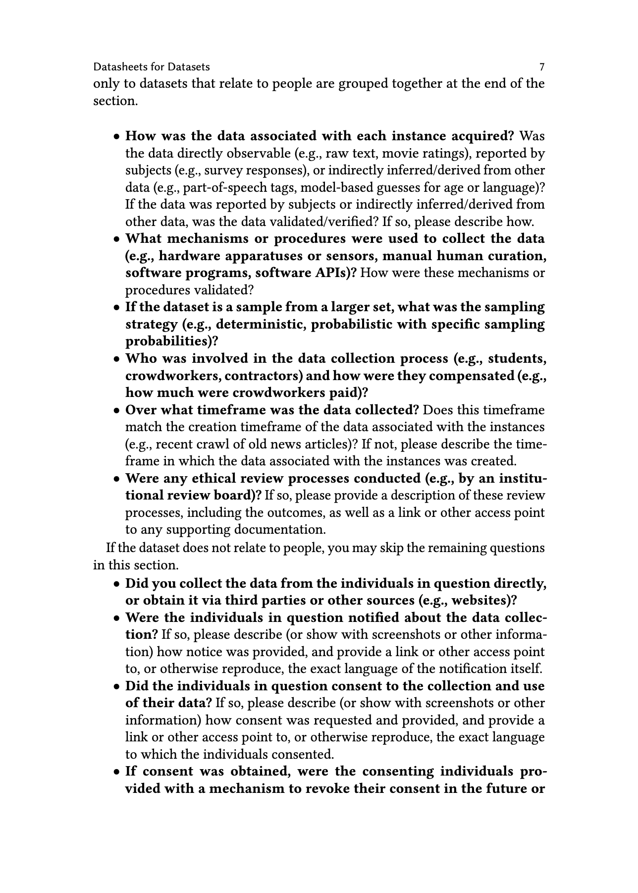{style="box-shadow: 5px 5px 15px rgba(0,0,0,0.5);" width=80%}

:::

::::

::: footer
Datasheets for Datasets: https://arxiv.org/pdf/1803.09010
:::

::: notes
These sorts of data provenance questions will differ depending on your industry and context. There are guidelines that exist out there that you can refine to your needs. Here is one provided by Datasheets for Datasets. These existing resources are a good starting off point. But I believe that really good data provenance requires stakeholder support and time. You may ask the wrong questions or miss some in the beginning, and it will take a few iterations. But it pays off — in your own confidence, in the quality of your analysis, and in the trust that builds when the people reviewing your work can see that you understood your data before you drew conclusions from it.
:::

## {background-image="images/eda.jpeg"}

::: {.absolute top="40%" style="text-align: center;" }
[Exploratory Data Analysis]{style="color: #4C4E52; background-color: white; font-size: 60px;"}
:::

::: notes
So, after sitting with your data and documenting what you know about it, you actually get to look at it. This is exploratory data analysis — and I'd guess most of you have done it in your courses here, and will keep doing it throughout your careers. This moves from questions about the metadata of your dataset to reports, metrics, and representations of what it actually contains.
:::

## Exploratory Data Analysis

:::{layout="[[1,1,1], [-1, 2, -1]]"}

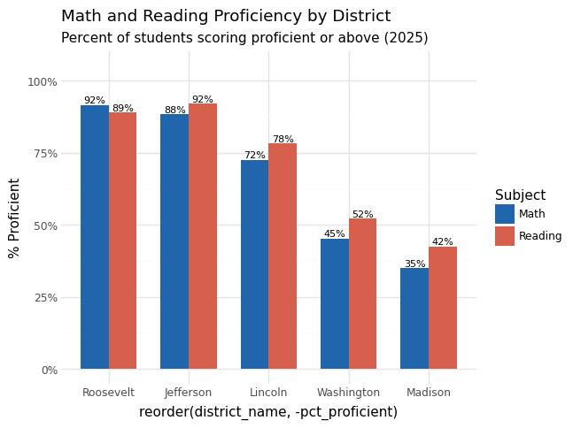

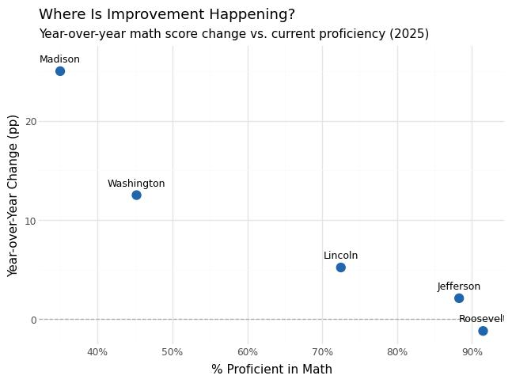

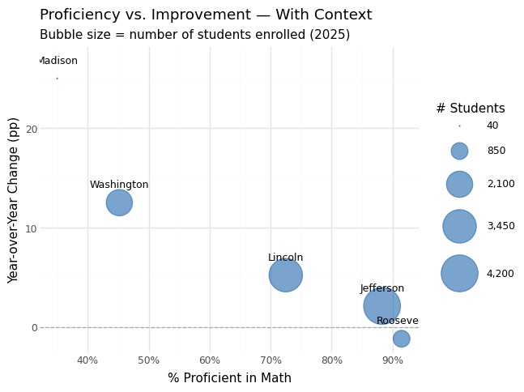

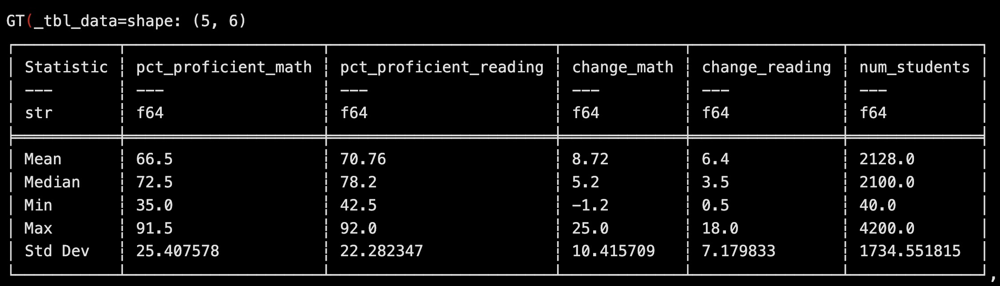

:::

## Anscombe's Quartet

```{python}
import polars as pl

# Anscombe's quartet data
data = {
    "x1": [10,8,13,9,11,14,6,4,12,7,5],
    "y1": [8.04,6.95,7.58,8.81,8.33,9.96,7.24,4.26,10.84,4.82,5.68],
    "x2": [10,8,13,9,11,14,6,4,12,7,5],
    "y2": [9.14,8.14,8.74,8.77,9.26,8.10,6.13,3.10,9.13,7.26,4.74],
    "x3": [10,8,13,9,11,14,6,4,12,7,5],
    "y3": [7.46,6.77,12.74,7.11,7.81,8.84,6.08,5.39,8.15,6.42,5.73],
    "x4": [8,8,8,8,8,8,8,19,8,8,8],
    "y4": [6.58,5.76,7.71,8.84,8.47,7.04,5.25,12.50,5.56,7.91,6.89],
}

df = pl.DataFrame(data)

# Function to compute summary stats
def summarize(x_col, y_col):
    return pl.DataFrame({
        "dataset": [y_col],
        "mean_x": [df[x_col].mean()],
        "mean_y": [df[y_col].mean()],
        "var_x": [df[x_col].var()],
        "var_y": [df[y_col].var()],
        "corr_xy": [df.select(pl.corr(x_col, y_col)).item()]
    })

# Compute summaries for all four datasets
summaries = pl.concat([
    summarize("x1", "y1"),
    summarize("x2", "y2"),
    summarize("x3", "y3"),
    summarize("x4", "y4"),
])

print(summaries)
```

##

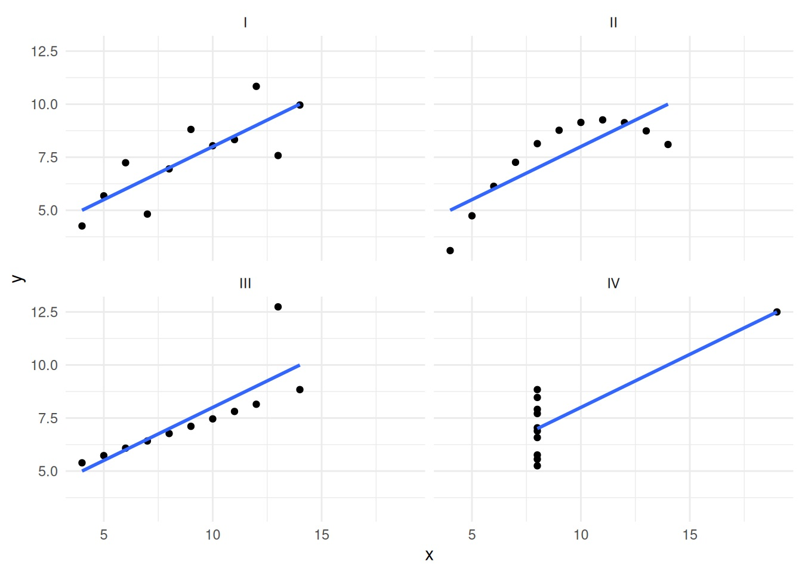{width=80% fig-alt="this is an image of something" fig-align="center" style="box-shadow: 5px 5px 15px rgba(0, 0, 0, 0.3); border-radius: 5px;"}

## {background-image="images/presentation.jpg"}

::: footer
Photo by <a href="https://unsplash.com/@jakubzerdzicki?utm_source=unsplash&utm_medium=referral&utm_content=creditCopyText">Jakub Żerdzicki</a> on <a href="https://unsplash.com/photos/a-person-holding-a-piece-of-paper-over-a-laptop-9PwLeZA-RGc?utm_source=unsplash&utm_medium=referral&utm_content=creditCopyText">Unsplash</a>
:::

::: notes
Early in my first data analyst job, my manager asked me to analyze school districts in our state — specifically, how test scores had changed over time. I was excited. I went off and built a visualization. When I came back to present it, I started walking her through the trends, and she stopped me and asked: how many students are we talking about here?
I didn't know. I hadn't checked. And I hadn't documented any of my steps, so I couldn't even retrace my thinking at the moment. It was embarrassing, but more than that — it took a while to rebuild her confidence in me.
What I should have done was slower and less exciting: before drawing any conclusions, sit with the data and ask basic questions. But one thing that I did do, was write down the experience so it would never happen again.
:::

## {background-image="images/pointblank.jpeg"}

## District Test Score Report

```{python}
#| echo: true
import polars as pl

district_data = pl.DataFrame({
    "district_id": ["D001", "D002", "D003", "D004", "D005"],
    "district_name": ["Lincoln", "Washington", "Jefferson", "Roosevelt", "Madison"],
    "year": [2025, 2025, 2025, 2025, 2025],
    "pct_proficient_math": [72.5, 45.2, 88.3, 91.5, 35.0],
    "pct_proficient_reading": [78.2, 52.1, 92.0, 89.0, 42.5],
    "change_math": [5.2, 12.5, 2.1, -1.2, 25.0],  # Year-over-year change
    "change_reading": [3.5, 8.5, 1.5, 0.5, 18.0],
})
```

## View Data

Preview using pointblank:

```{python}
#| echo: true
import pointblank as pb

pb.preview(district_data)
```

. . .

- Math ranges from 35.0% (Madison) to 91.5% (Roosevelt); reading from 42.5% to 92.0%.

## Deeper Dive

```{python}
#| echo: true
pb.col_summary_tbl(data=district_data, tbl_name="district_test_scores_received")
```

. . .

- High standard deviations (~25pp math, ~22pp reading) reflect large inequality between districts.

## Make Plots

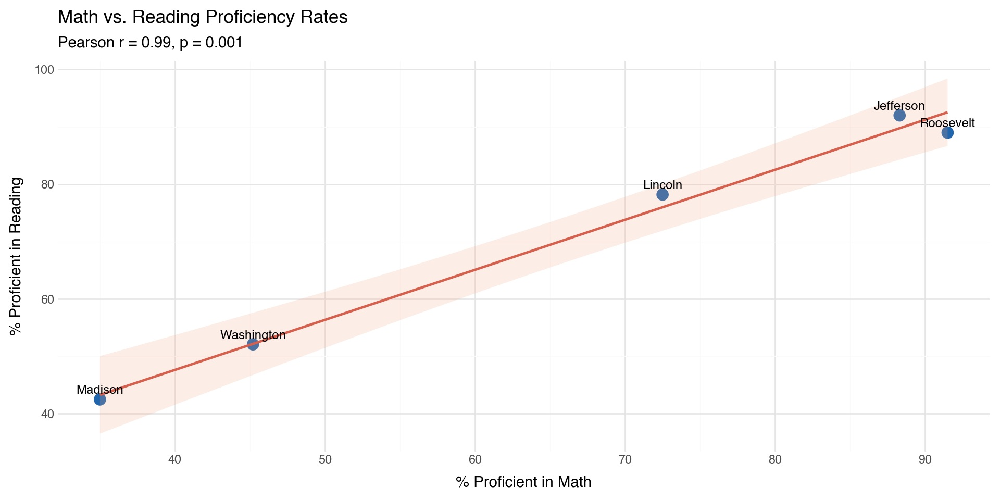{fig-align="center"}

- Strong positive correlation between math and reading proficiency.

::: notes
Following procedure does not mean understanding. There was nothing that EDA could have done to help me with my manager's question without thinking more deeply about what I was doing. But now that I have learned my lesson, I could start building the procedural trust back.
:::

## {background-image="images/validation.jpeg"}

::: {.absolute top="40%" style="text-align: center;" }
[Data Validation]{style="color: #4C4E52; background-color: white; font-size: 120px;"}
:::

::: notes
The next step of procedural trust that I want to introduce is data validation. They create a systematic check that doesn’t rely on us remembering to look.  EDA makes problems visible (you have to actively ignore them) but validation rules catch problems automatically (even when you’re distracted).
:::

## Data Validation

::: columns

::: column
* Thresholds
* Ranges
* Type Check
:::

::: column
* Formats and Patterns
* Consistency
* Presence
:::

::::

::: notes
It’s baking those assumptions that you generated in the provenance and EDA stage into actual rules you can test. which matters even more when you're running something more than once or when you are manipulating the data. Data pipelines break in quiet ways. A column that used to have four categories now has five because someone added a new product type. A timestamp format changed two months ago and no one updated the documentation. Null values that were encoded as -999 in the old system are now actual NULLs because someone "fixed" the upstream ETL. Your documented assumptions are what make these moments catchable. If you wrote down that your data should start in January 2020 and cover roughly 300 districts, you'll notice when a refreshed dataset suddenly starts in March or drops to 287. Without that baseline, you're flying blind — and the error travels quietly into your output. So treat every data pull as potentially different from the last. If you're running something on a schedule, or someone hands you a refreshed file, the question isn't just “did it run?” It's "has anything changed that I need to know about?
:::

## Student Counts

```{python}
#| echo: true
counts_data = pl.DataFrame(
    {
        "district_id": ["D001", "D002", "D003", "D004", "D005"],
        "year": [2025, 2025, 2025, 2025, 2025],
        "num_students": [3450, 2100, 4200, 850, 40],
        "students_proficient_math": [2501, 949, 3709, 778, 14],
        "students_proficient_reading": [2697, 1094, 3864, 757, 17],
    }
)

pb.preview(counts_data)
```


::: notes
In reality, the percentage data and the count data often come from different sources. When I went back to ask for the denominators, I found the counts were in a separate dataset from the enrollment system.
:::


## Complete Dataset After Joining

```{python}
#| echo: true
complete_data = district_data.join(counts_data, on=["district_id", "year"], how="left")

pb.preview(complete_data)
```

::: notes
Now I need to join these two datasets together to have the complete picture:
:::

## Return to EDA

```{python}
pb.col_summary_tbl(data=complete_data, tbl_name="district_test_scores_complete")
```

::: notes
After joining datasets, it’s critical to validate that the join worked correctly and that we now have all the data we need. Let’s use Pointblank to verify: Now there are 10 columns instead of 7. Look what appeared after the join: - num_students - ranges from 40 to 4,200 students - students_proficient_math - the actual count of proficient students - students_proficient_reading - the actual count of proficient students. This context changes everything. By running col_summary_tbl() on the complete data, I can confirm that: 1. The join succeeded (no new null values introduced) 2. The critical denominator columns are now present 3. The data ranges make sense. But EDA alone isn’t enough. What if the join silently failed for some rows? What if future data updates break the join? This is where validation rules become essential. After joining datasets, you can’t just assume everything worked perfectly. Joins can silently fail, introduce nulls, or produce unexpected results. Pointblank helps you validate that the join succeeded and that you now have complete data.
:::

## Validate the Join Succeeded

```{.python code-line-numbers="|7|8-14|15|16|17"}
validation = (
    pb.Validate(
        data=complete_data,
        tbl_name="school_district_scores",
        label="School District Test Score Analysis - Post-Join Validation",
    )
    .col_exists(columns=["district_id", "pct_proficient_math", "change_math"])
    .col_exists(
        columns=[
            "num_students",
            "students_proficient_math",
            "students_proficient_reading",
        ]
    )
    .col_vals_not_null(columns=["num_students", "students_proficient_math"])
    .col_vals_gt(columns=["num_students"], value=0)
    .col_vals_ge(columns=["students_proficient_math"], value=0)
)

validation.interrogate().get_tabular_report()
```

::: notes
This validation catches join failures immediately: - If the join drops rows, the row count check will fail - If the join produces nulls (no match found), the not_null check will fail - If the counts data has bad values, the range checks will fail
:::

## Validate the Join Succeeded

```{python code-line-numbers="|7|8-14|15|16|17"}
validation = (
    pb.Validate(
        data=complete_data,
        tbl_name="school_district_scores",
        label="School District Test Score Analysis - Post-Join Validation",
    )
    .col_exists(columns=["district_id", "pct_proficient_math", "change_math"])
    .col_exists(
        columns=[
            "num_students",
            "students_proficient_math",
            "students_proficient_reading",
        ]
    )
    .col_vals_not_null(columns=["num_students", "students_proficient_math"])
    .col_vals_gt(columns=["num_students"], value=0)
    .col_vals_ge(columns=["students_proficient_math"], value=0)
)

validation.interrogate().get_tabular_report()
```

## Validate That Percentages Match the Counts

```{.python code-line-numbers="|3-8|12-17"}
verification = complete_data.with_columns(
    [
        (pl.col("students_proficient_math") / pl.col("num_students") * 100)
        .round(1)
        .alias("calculated_pct_math"),
        (pl.col("students_proficient_reading") / pl.col("num_students") * 100)
        .round(1)
        .alias("calculated_pct_reading"),
    ]
).with_columns(
    [
        (pl.col("pct_proficient_math") == pl.col("calculated_pct_math"))
        .cast(pl.Int64)
        .alias("math_pct_matches"),
        (pl.col("pct_proficient_reading") == pl.col("calculated_pct_reading"))
        .cast(pl.Int64)
        .alias("reading_pct_matches"),
    ]
)

verification_summary = verification.select(
    [
        "district_name",
        "num_students",
        "students_proficient_math",
        "pct_proficient_math",
        "calculated_pct_math",
        "math_pct_matches",
    ]
)

pb.preview(verification_summary)
```

## Validate That Percentages Match the Counts

```{python code-line-numbers="|3-8|12-17|21-30"}
verification = complete_data.with_columns(
    [
        (pl.col("students_proficient_math") / pl.col("num_students") * 100)
        .round(1)
        .alias("calculated_pct_math"),
        (pl.col("students_proficient_reading") / pl.col("num_students") * 100)
        .round(1)
        .alias("calculated_pct_reading"),
    ]
).with_columns(
    [
        (pl.col("pct_proficient_math") == pl.col("calculated_pct_math"))
        .cast(pl.Int64)
        .alias("math_pct_matches"),
        (pl.col("pct_proficient_reading") == pl.col("calculated_pct_reading"))
        .cast(pl.Int64)
        .alias("reading_pct_matches"),
    ]
)

verification_summary = verification.select(
    [
        "district_name",
        "num_students",
        "students_proficient_math",
        "pct_proficient_math",
        "calculated_pct_math",
        "math_pct_matches",
    ]
)

pb.preview(verification_summary)
```

## Validate That ALL Percentages Match

```{.python code-line-numbers="8-9"}
validation_percentage_consistency = (
    pb.Validate(
        data=verification,
        tbl_name="school_district_scores",
        label="Percentage-Count Consistency Check",
    )
    .rows_distinct(columns_subset=["district_id", "year"])
    .col_vals_eq(columns=["math_pct_matches"], value=1)
    .col_vals_eq(columns=["reading_pct_matches"], value=1)
)

validation_percentage_consistency.interrogate().get_tabular_report()
```

::: notes
This validation catches inconsistencies between the two datasets: - If the join creates duplicate rows, rows_distinct will fail - If percentages don’t match the counts, there’s a data quality issue in one of the source datasets - If keys don’t match properly during the join, the calculated percentages won’t align
:::

## Validate That ALL Percentages Match

```{python}
validation_percentage_consistency = (
    pb.Validate(
        data=verification,
        tbl_name="school_district_scores",
        label="Percentage-Count Consistency Check",
    )
    .rows_distinct(columns_subset=["district_id", "year"])
    .col_vals_eq(columns=["math_pct_matches"], value=1)
    .col_vals_eq(columns=["reading_pct_matches"], value=1)
)

validation_percentage_consistency.interrogate().get_tabular_report()
```


## Validate Percentage-Count Consistency

```{.python code-line-numbers="7-8|9-19"}
validation_with_consistency = (
    pb.Validate(
        data=complete_data,
        tbl_name="school_district_scores",
        label="Percentage-Count Consistency Validation",
    )
    .col_vals_between(columns=["pct_proficient_math"], left=0, right=100)
    .col_vals_between(columns=["pct_proficient_reading"], left=0, right=100)
    .col_vals_le(columns=["students_proficient_math"], value=pb.col("num_students"))
    .col_vals_le(columns=["students_proficient_reading"], value=pb.col("num_students"))
)

validation_with_consistency.interrogate().get_tabular_report()
```

::: notes
These checks catch inconsistencies between the two datasets: - Percentages outside 0-100 range indicate data entry errors - Proficient counts > total students indicates a join mismatch or data quality issue
:::

## Validate Percentage-Count Consistency

```{python}
validation_with_consistency = (
    pb.Validate(
        data=complete_data,
        tbl_name="school_district_scores",
        label="Percentage-Count Consistency Validation",
    )
    .col_vals_between(columns=["pct_proficient_math"], left=0, right=100)
    .col_vals_between(columns=["pct_proficient_reading"], left=0, right=100)
    .col_vals_le(columns=["students_proficient_math"], value=pb.col("num_students"))
    .col_vals_le(columns=["students_proficient_reading"], value=pb.col("num_students"))
)

validation_with_consistency.interrogate().get_tabular_report()
```

## Create a “Safe to Report” Flag

```{python}
#| echo: true
#| output-location: slide
reporting_data = complete_data.with_columns(
    [
        pl.when(pl.col("num_students") >= 100)
        .then(pl.lit("✅ Reliable"))
        .when(pl.col("num_students") >= 50)
        .then(pl.lit("⚠️  Use with caution"))
        .otherwise(pl.lit("❌ Too small"))
        .alias("reliability_flag"),
        (pl.col("num_students") * pl.col("change_math") / 100)
        .round(0)
        .cast(pl.Int64)
        .alias("students_improved_math"),
    ]
)

reporting_summary = reporting_data.select(
    [
        "district_name",
        "num_students",
        "change_math",
        "students_improved_math",
        "reliability_flag",
    ]
).sort("change_math", descending=True)

pb.preview(reporting_summary)
```

::: notes
Now it’s impossible to miss that Madison’s impressive percentage is based on a tiny sample. This applies beyond education data. Any time you work with: - Conversion rates (need: total visitors) - Success rates (need: total attempts) - Percentages (need: total population) - Rates per capita (need: population sizes) - Proportions (need: group sizes)
:::

## {background-image="images/code.jpg"}

::: {.absolute top="25%" style="text-align: center;" }
[Code-First Data Science]{style="color: #4C4E52; background-color: white; font-size: 120px;"}
:::

::: footer
Photo by <a href="https://unsplash.com/@artturijalli?utm_source=unsplash&utm_medium=referral&utm_content=creditCopyText">Artturi Jalli</a> on <a href="https://unsplash.com/photos/black-flat-screen-computer-monitor-g5_rxRjvKmg?utm_source=unsplash&utm_medium=referral&utm_content=creditCopyText">Unsplash</a>
:::

## Your Code As Documentation

```python
complete_data = district_data.join(
    counts_data, on=["district_id", "year"], how="left"
)
```

. . .

**Data Integration Decision**

- Two separate data sources
- This wasn't the original structure

**Join Strategy**

- All districts from district_data are kept, even if they don't have matching counts
- Prefer incomplete data over lost data

::: notes
The code itself is an artifact that explains the analytical decisions that would otherwise be invisible. Anyone reviewing this code knows exactly when and how the data sources merged. 
:::

## Your Code As Documentation

```python
complete_data = district_data.join(
    counts_data, on=["district_id", "year"], how="left"
)
```

**Matching Logic**

- Two keys used: district_id AND year define uniqueness
- Assumption made explicit: A district in a specific year is the unit of analysis
- Time dimension matters: The same district across different years are separate records

::: notes
This is one of the real gifts of code-first data science. When you write an R or Python script instead of clicking through a graphical interface, you've documented your analysis as a byproduct of doing it. And the artifacts code-first work produces are themselves a form of documentation. A script records every transformation. A notebook weaves your reasoning and your code together. A validation report like the one we just built shows exactly what you checked before you started. A README records where the data came from and when. None of this requires extra effort — it's what you're already doing, made legible.

:::

##

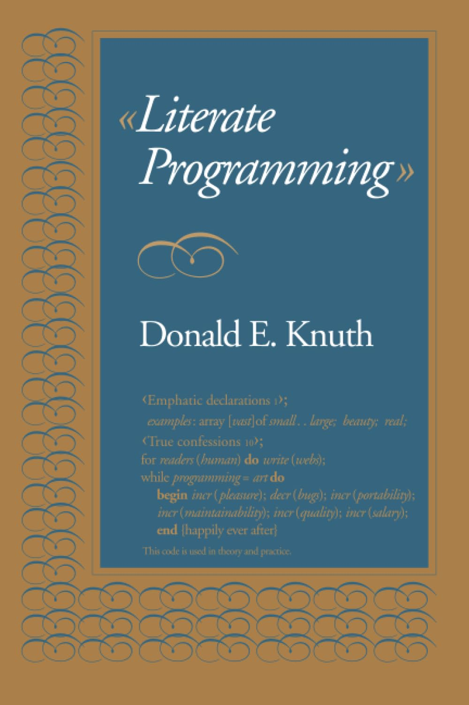{fig-align="center"}

## {background-image="images/quarto.jpeg"}

## Your Code + Narrative As Documentation

```` {.markdown filename="validation-report.qmd" code-line-numbers="|1-5|7-12|14-18|20-58"}
---
title: "School District Pre-Analysis Check"
date: 2026-01-01
author: Your Name
---

**Background**

* Requestor: My Manager's Name
* Data Source(s):
  * Source 1: URL
  * Source 2: URL

**The validation below checks three critical assumptions:**

- No missing student counts (prevents denominator errors)
- Percentages stay within valid range (catches data entry errors)
- Proficient counts don't exceed total students (catches join mismatches)

```{{python}}
#| echo: false
import polars as pl
import pointblank as pb

# Create district_data
district_data = pl.DataFrame({
    "district_id": ["D001", "D002", "D003", "D004", "D005"],
    "district_name": ["Lincoln", "Washington", "Jefferson", "Roosevelt", "Madison"],
    "year": [2025, 2025, 2025, 2025, 2025],
    "pct_proficient_math": [73.0, 45.2, 88.3, 91.5, 35.0],
    "pct_proficient_reading": [78.2, 52.1, 92.0, 89.0, 42.5],
    "change_math": [5.2, 12.5, 2.1, -1.2, 25.0],
    "change_reading": [3.5, 8.5, 1.5, 0.5, 18.0],
})

# Create counts_data
counts_data = pl.DataFrame({
    "district_id": ["D001", "D002", "D003", "D004", "D005"],
    "year": [2025, 2025, 2025, 2025, 2025],
    "num_students": [3450, 2100, 4200, 850, 40],
    "students_proficient_math": [2501, 949, 3709, 778, 14],
    "students_proficient_reading": [2697, 1094, 3864, 757, 17],
})

# Join to create complete_data
complete_data = district_data.join(
    counts_data, on=["district_id", "year"], how="left"
)

validation = (
    pb.Validate(data=complete_data, label="Pre-Analysis Check")
    .col_vals_not_null(columns=["num_students"])
    .col_vals_between(columns=["pct_proficient_math"], left=0, right=100)
    .col_vals_le(columns=["students_proficient_math"], value=pb.col("num_students"))
)

validation.interrogate().get_tabular_report()
```
````

## Your Code + Narrative As Documentation

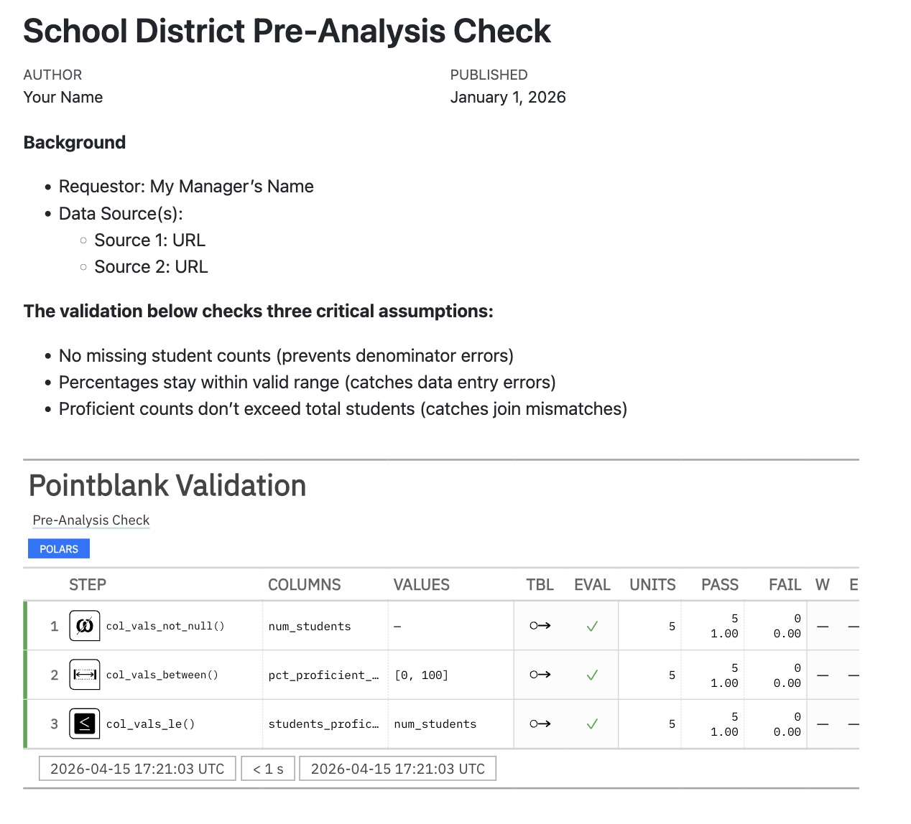{width=80% fig-alt="this is an image of something" fig-align="center" style="box-shadow: 5px 5px 15px rgba(0, 0, 0, 0.3); border-radius: 5px;"}

::: notes
This is procedural trust in action. The Pointblank code runs the checks automatically. The narrative explains why each check matters and what could go wrong. And Quarto weaves them together into a document that someone else can open, read, and re-run to verify your work. This is what Chambers meant by work that can be shown to be trustworthy — not just technically correct, but visibly, reproducibly correct. You're not asking anyone to trust you blindly. You're showing them your reasoning and giving them the means to verify it themselves.
:::


## {background-image="images/reproducability.jpg"}

::: {.absolute top="25%" style="text-align: center;" }
[Reproducibility]{style="color: #4C4E52; background-color: white; font-size: 120px;"}
:::

::: footer
Photo by <a href="https://unsplash.com/@mero_dnt?utm_source=unsplash&utm_medium=referral&utm_content=creditCopyText">Chinh Le Duc</a> on <a href="https://unsplash.com/photos/assorted-color-star-themed-decors-poK5c-QWy1E?utm_source=unsplash&utm_medium=referral&utm_content=creditCopyText">Unsplash</a>
:::

::: notes
Someone else can take your code, run it on your data, and arrive at the same result. That's what reproducibility means in practice — and it's what Chambers meant by work that can be shown to be trustworthy. It isn't just a value. It's a technical property that code makes tractable.
:::

##

**Your Machine**

```python
complete_data = district_data.join(
    counts_data, on=["district_id", "year"], how="left"
)
```

. . .

**My Machine**

```python
complete_data = district_data.join(
    counts_data, on=["district_id", "year"], how="left"
)
```

. . .

<br>

```{.bash filename="requirements.txt"}
polars==1.39.3
pointblank==0.23.0
```

## {background-image="images/open-source.jpg"}

::: {.absolute top="25%" style="text-align: center;" }
[Open Source Tools]{style="color: #4C4E52; background-color: white; font-size: 120px;"}
:::

::: footer
Photo by <a href="https://unsplash.com/@markuswinkler?utm_source=unsplash&utm_medium=referral&utm_content=creditCopyText">Markus Winkler</a> on <a href="https://unsplash.com/photos/a-typewriter-on-a-table-NdhQbeGTA58?utm_source=unsplash&utm_medium=referral&utm_content=creditCopyText">Unsplash</a>
:::

## {background-image="images/pointblank-repo.jpeg"}

## {background-image="images/pointblank-issue.jpeg"}

## {background-image="images/version-control.jpeg"}

::: {.absolute top="40%" style="text-align: center;" }
[Version Control]{style="color: #4C4E52; background-color: white; font-size: 120px;"}
:::

::: notes
I want to mention another tool that is helping make the invisible visible, version control. Version control means your work has a history. You can literally see every draft, every correction, every time something changed and why. For those working with you, they can see what you have done and changed over time. For you, you can trust your changes have been made and have been recorded, and you can always go back to a previous version if needed.
:::

## Version Control {background-image="images/visual.jpeg" background-opacity="10%"}

:::: columns

::: column
* Track every change made to your files
* Multiple people working on the same files
* Have a "master" source of truth
:::

::: column
* Go back to a previous "working" version
* Serves as a history log
* Know exactly who changed what and when
:::

::::

::: footer
[A Visual Guide to Version Control](https://medium.com/@karandeol2611/a-visual-guide-to-version-control-078d295354e7)
:::

## {background-image="images/ai.jpg"}

::: {.absolute top="25%" style="text-align: center;" }
[LLM Guardrails and Oversight]{style="color: #4C4E52; background-color: white; font-size: 120px;"}
:::

::: notes
Now, let’s talk about something that turns all of this on its head: AI. Do any of you use Copilot, Codex, or Claude Code in your work or coursework?
:::

## Claude Code

::: {style="text-align: center;"}

:::

::: notes
You may have heard of vibe coding, Prompt-Based Programming / Natural Language Programming. This is what called agentic system. The distinction lies in its ability to operate within a continuous agentic loop—meaning it doesn't just suggest code for you to copy-paste; it executes a multi-step cycle of reasoning and action to solve complex problems autonomously. It autonomously searches your codebase, reads files, and explores directory structures to understand the project.It can create, edit, rename, or delete files and run shell commands directly in your terminal.

:::

## Databot

::: {style="text-align: center;"}

:::

##

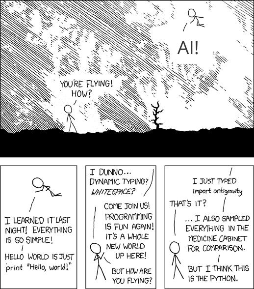{fig-align="center"}

::: notes
These tools are genuinely extraordinary. Projects that previously required rare specialization are now approachable. Code that would have taken hours to write can be drafted in minutes.
:::

##

::: {style="font-size: 1.5em;"}
...Both the data analyst and the software provider therefore have a strong responsibility to produce a result that is trustworthy, and, if possible, one that can be shown to be trustworthy...
:::

## The Problems with LLMs {.smaller}

::: scrollable

- **Data provenance:** Training data is proprietary and undisclosed
- **Data lineage:** Cannot trace how inputs become outputs
- **Data contracts:** No guarantees about output format or correctness
- **Observability:** Decision-making process is opaque
- **Data dictionaries:** No clear mapping of concepts or definitions used
- **Monitoring:** No way to detect when model behavior changes
- **Versioning:** Model updates are released without change logs
- **Unit tests:** Non-deterministic outputs cannot be reliably tested
- **Code review:** Cannot inspect the "reasoning" that led to an answer
- **Disaggregation:** Cannot break down how confidence is distributed
- **Metadata:** Limited information about training, capabilities, or limitations
- **Confidence intervals:** Provides fluent answers with no statistical uncertainty
- ...

:::

::: notes
AI tools may carry this responsibility in theory. In practice, I would argue they are among the least equipped to fulfill it of any tool we have ever used in data science. Think about what we've been discussing around procedural trust, documented assumptions, the ability to trace a result back to its origins. Large language models throw most of that out the window. They are black boxes — we don't know what data trained them, we can't fully inspect their decision-making, and with every new release it's genuinely unclear what has changed and why. They are non-deterministic, which means you cannot reliably reproduce the same answer twice. And they are well-documented for producing confident, fluent, wrong answers — not occasionally, but routinely.
:::

##

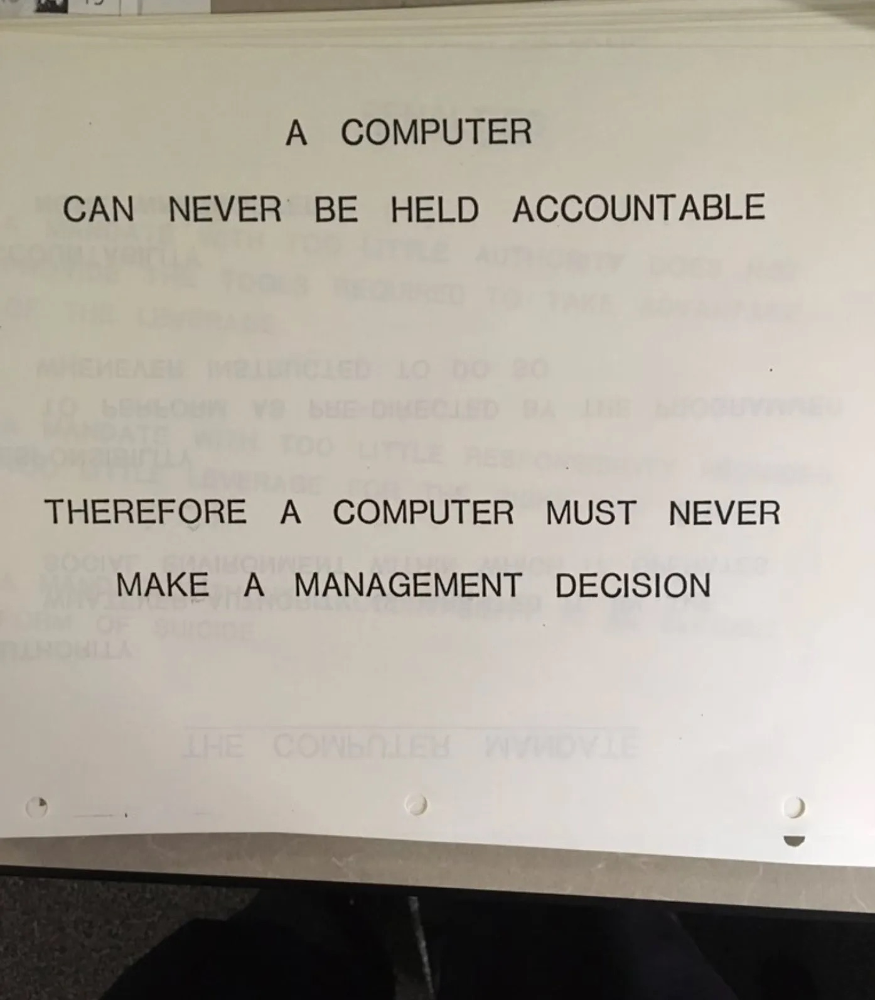{fig-align="center"}

::: notes
There's a quote that's been circulating in technology ethics circles for decades, often attributed to IBM: That was written long before large language models existed, and it still holds up today. Here's what I want to be clear about: any harm that results from AI in data work is the result of human decisions — decisions about when to use it, how to use it, and whether to check its work. And that means the obligation we've been talking about all along doesn't go away. It gets heavier. So, let’s talk about how we make our trust in LLMs something we can actually see through guardrails.
:::

##

{fig-align="center"}

## {background-image="images/fundamentals.jpg"}

::: {.absolute top="25%" style="text-align: center;" }
[Know the Fundamentals]{style="color: #4C4E52; background-color: white; font-size: 120px;"}
:::

::: footer
Photo by <a href="https://unsplash.com/@uns__nstudio?utm_source=unsplash&utm_medium=referral&utm_content=creditCopyText">Unseen Studio</a> on <a href="https://unsplash.com/photos/person-writing-on-brown-wooden-table-near-white-ceramic-mug-s9CC2SKySJM?utm_source=unsplash&utm_medium=referral&utm_content=creditCopyText">Unsplash</a>
:::

##

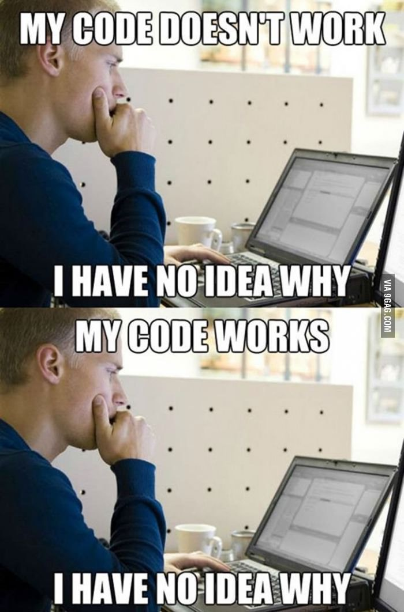{fig-align="center"}

##

```{.python code-line-numbers="|5|7-8"}
import pandas as pd

def filter_by_date(filepath, start_date, end_date):
    df = pd.read_csv(filepath)
    df["date"] = pd.to_datetime(df["date"], errors="coerce")

    mask = (df["date"] >= start_date) & (df["date"] <= end_date)
    filtered = df[mask]

    return filtered.groupby("category")["value"].sum()
```

::: notes
Reads time-series data from a CSV file, filters it by date range, and returns category-wise totals
:::

## Data Validation Checks for AI Work

```python
validation = (
          pb.Validate(data=df)
          .col_exists(columns=["date", "category", "value"])
          .col_vals_not_null(columns="date")
          .col_vals_regex(columns="date", pattern=r"^\d{4}-\d{2}-\d{2}")
  format
          .col_vals_not_null(columns="value")
          .interrogate()
      )
```

##

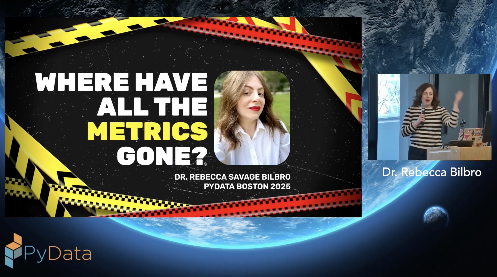{fig-align="center"}


::: footer
[Where have all the metrics gone](https://www.youtube.com/watch?v=y8QhjahS8VY&list=PLGVZCDnMOq0qmerwB1eITnr5AfYRGm0DF&index=10)
:::

## {background-image="images/fundamentals.jpg"}

::: {.absolute top="15%" style="text-align: center;" }
[Use LLMs As Tutors and Reviewers]{style="color: #4C4E52; background-color: white; font-size: 120px;"}
:::

::: footer
Photo by <a href="https://unsplash.com/@uns__nstudio?utm_source=unsplash&utm_medium=referral&utm_content=creditCopyText">Unseen Studio</a> on <a href="https://unsplash.com/photos/person-writing-on-brown-wooden-table-near-white-ceramic-mug-s9CC2SKySJM?utm_source=unsplash&utm_medium=referral&utm_content=creditCopyText">Unsplash</a>
:::

##

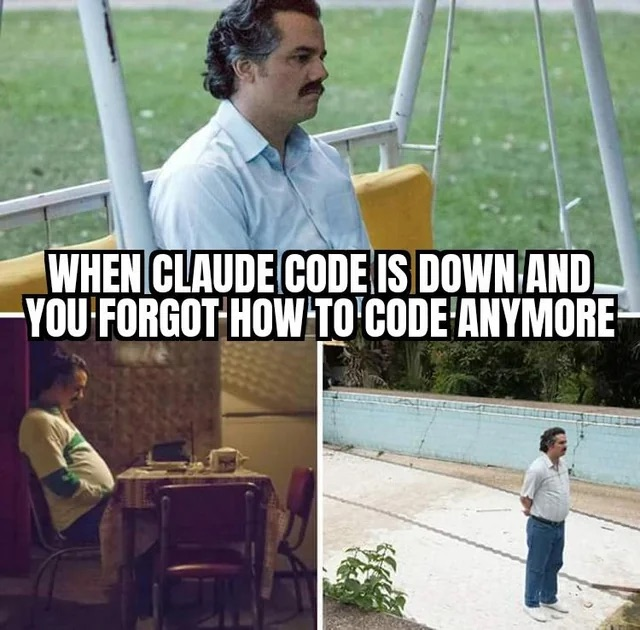{fig-align="center"}

## {background-image="images/learning-skill.jpeg"}

##

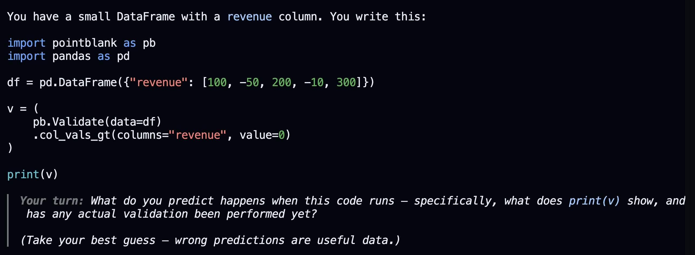

## {background-image="images/r-reviewer.jpeg"}

::: notes
When you call this Skill, it looks at the feature you're looking at and figures out what you've changed and decide a review agent.
:::


## {background-image="images/fundamentals.jpg"}

::: {.absolute top="25%" style="text-align: center;" }
[Break Up The Process]{style="color: #4C4E52; background-color: white; font-size: 120px;"}
:::

##

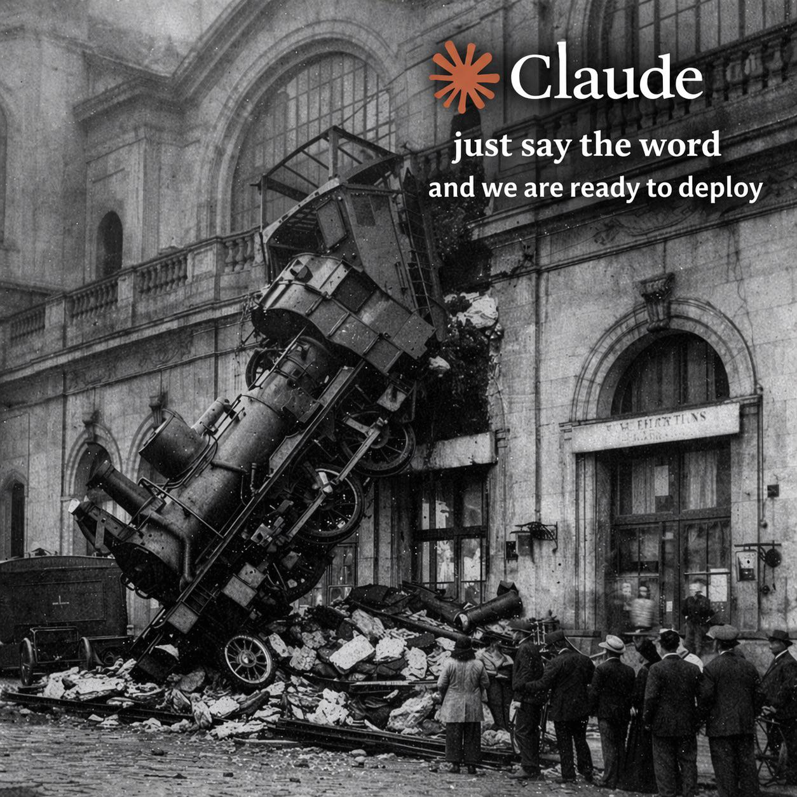{fig-align="center"}

##

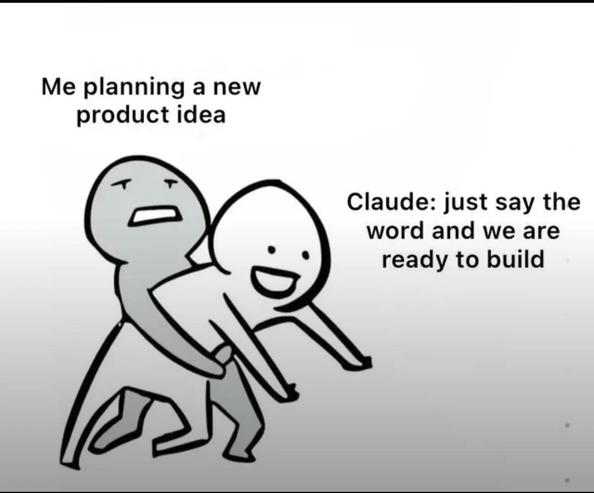{fig-align="center"}


## {background-image="images/blocks.jpg"}

## Use Planning Mode

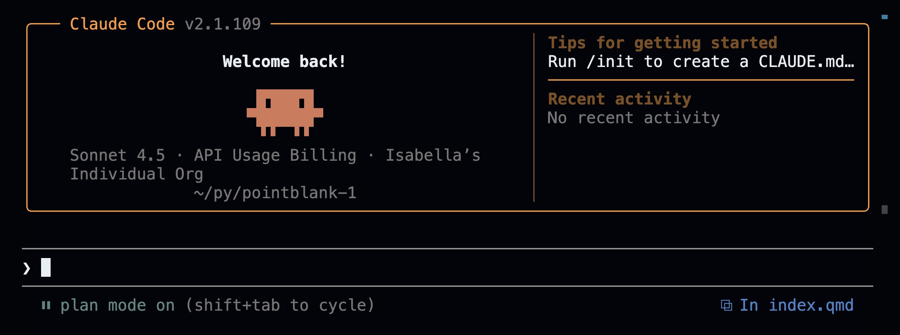

## {background-image="images/version-control.jpeg"}

::: {.absolute top="40%" style="text-align: center;" }
[Version Control]{style="color: #4C4E52; background-color: white; font-size: 120px;"}
:::

::: notes
Version control is your best friend.
:::

##

::: {layout-ncol=2}
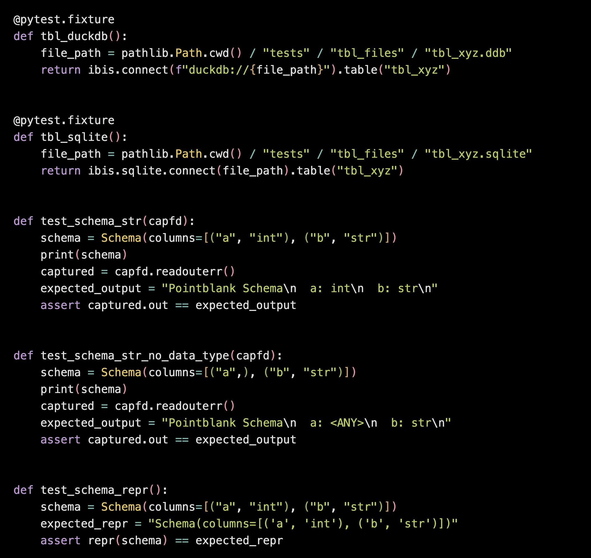


:::

##

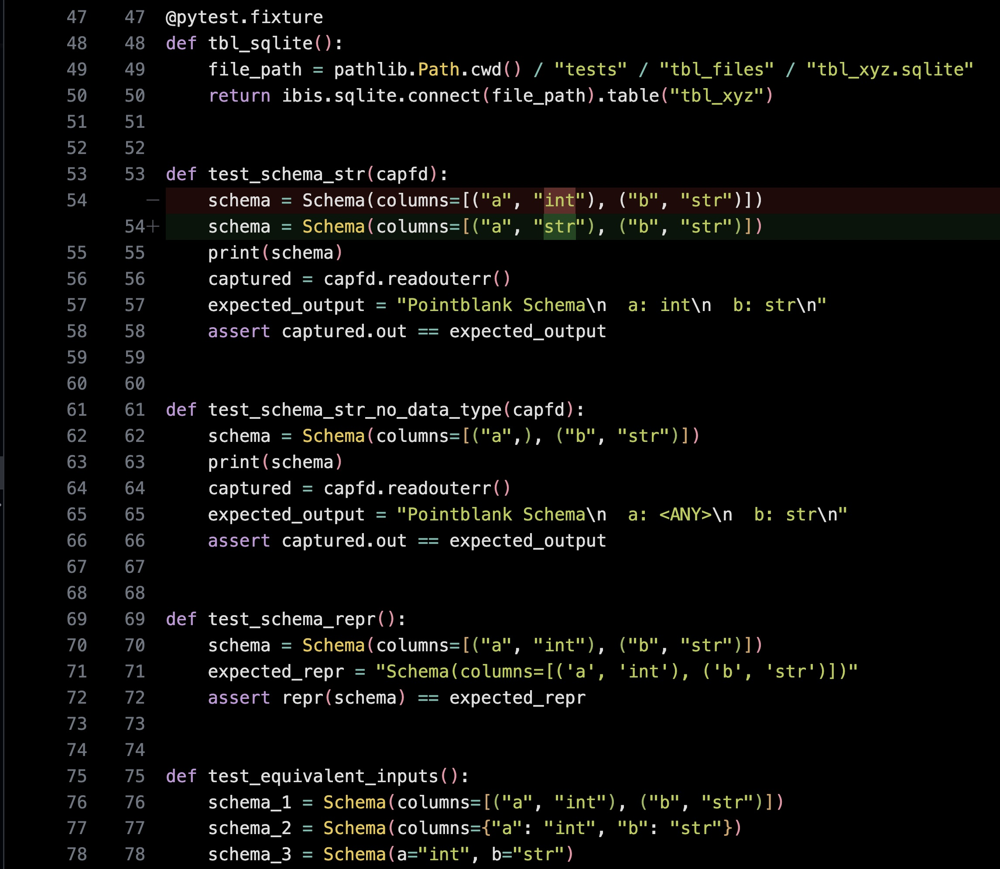{fig-align="center"}

## {background-color="#2E1836"}

::: {.absolute top="30%" left="0" right="0" style="text-align: center; font-size: 3em;"}
Wrap Up
:::

## {background-image="images/trust.jpg"}

::: footer
Photo by <a href="https://unsplash.com/@headwayio?utm_source=unsplash&utm_medium=referral&utm_content=creditCopyText">Headway</a> on <a href="https://unsplash.com/photos/black-smartphone-near-person-5QgIuuBxKwM?utm_source=unsplash&utm_medium=referral&utm_content=creditCopyText">Unsplash</a>
:::

::: notes
Let's return to the question in the beginning: if our tools are opaque and sometimes unknowable, how do we build trust in them such that we can show others we are trustworthy? I hope by now you have some answers. I know it's not a complete list — invisible work and inherited decisions show up everywhere in data science, in ways no single talk can fully map. The assumptions are baked into a statistical method. The organizational priorities that shaped what data was worth collecting in the first place. The design decisions in tools you'll use for years without ever reading the source. The layers go deeper than we've had time to cover today.
:::

##

::: {.absolute top="30%" left="0" right="0" style="text-align: center; font-size: 3em;"}
trusting*
:::

## {background-color="#2E1836"}

::: {.absolute top="30%" left="0" right="0" style="text-align: center; font-size: 3em;"}
Thank You
:::
